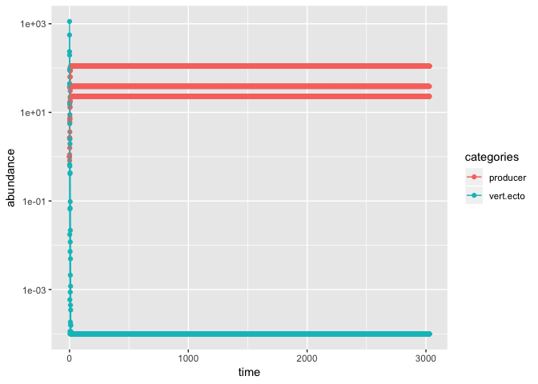

Untitled
================

Load functions we'll use throughout

``` r
library(tidyverse)
```

Niche and Cascade Models
------------------------

There are a few functions already written to generate food webs using the cascade model and the niche model (Williams & Martinez 2000 Nature, doi: 10.1038/35004572), provided by Owen Petchy:

``` r
source("petchey_food_web_functions.R")
```

For a given number of species (*S*), a given number of links (*L*), generate one (N = 1) or a list (N &gt; 1) of networks as adjacency matrices.

``` r
Cascade.model(S = 5, L = 5, N = 1)
```

    ##   1 2 3 4 5
    ## 1 0 1 0 0 0
    ## 2 0 0 0 1 1
    ## 3 0 0 0 0 1
    ## 4 0 0 0 0 1
    ## 5 0 0 0 0 0

``` r
Niche.model(S = 5, L = 5, N = 1)
```

    ##   1 2 3 4 5
    ## 1 0 0 0 0 1
    ## 2 0 0 0 0 1
    ## 3 0 0 0 0 0
    ## 4 0 0 0 0 0
    ## 5 0 0 0 0 0

Allometric Trophic Network (ATN) models
---------------------------------------

Following the example of an implementation by Iles & Novak (2016 The American Naturalist, doi: 10.1086/686730; see also Brose et al. 2006 Ecology Letters, doi: 10.1111/j.1461-0248.2006.00978.x), the general steps for implementing an ATN model are:

1.  Generate a food web using the niche or cascade model, for a chosen number of species and connectance
2.  Assign body sizes to the species, based on consumer-resource mass ratios
3.  Use as inputs to Yodzis & Innes's bioenergetic model of consumer-resource dynamics

This workflow has recently been implemented for **julia**, a different programming language, in Delmas et al. 2017 Methods in Ecology & Evolution (doi: 10.1111/2041-210X.12713).

There is also a non-CRAN version of a package for R available, `gruyere`

``` r
## must have "cheddar" and "deSolve"

library(cheddar); library(deSolve)
devtools::install_github("quicklizard99/gruyere")
```

    ## Skipping install of 'gruyere' from a github remote, the SHA1 (50231de6) has not changed since last install.
    ##   Use `force = TRUE` to force installation

``` r
library(gruyere)

#library("gruyere", lib.loc="/Library/Frameworks/R.framework/Versions/3.5/Resources/library")
```

This package is also available for source download at:<http://quicklizard99.github.io/gruyere/>, inside of which can be found the example vignette.

From the vignette, can implement a test run.

#### Helper functions to generate ATN models with "gruyere"

``` r
# function to assign body size to secondary consumers
# in a vector
generate_sc_size <- function(tl) {
  n_rand <- round(tl) - 1
  
  draws <- sapply(X = n_rand, FUN = function(x) rlnorm(n = x, meanlog = 2.73, sdlog = (1.60/x)))
  
  return(unlist(lapply(X = draws, FUN = function(x) prod(x))))

}

# assign body size based on trophic levels
get_sizes <- function(web_tl) {
  n <- length(web_tl)
  
  # producers = 1
  producer_size <- ifelse(web_tl == 1, 1, 0)
  
  # primary-consumers
  n_pc <- length(which(web_tl == 2))
  if (n_pc != 0) {
    primary_consumer_size <- ifelse(
      web_tl == 2,
      rlnorm(1, meanlog = 0.65, sdlog = 1.52),
      0)
  } else {
    primary_consumer_size <- rep(0, n)
  }
  
  # secondary-conumeers
  n_sc <- length(which(web_tl > 2))
  if (n_sc != 0) {
    secondary_consumer_size <- ifelse(
      web_tl > 2,
      generate_sc_size(web_tl),
      0
    )
    
  } else {
    secondary_consumer_size <- rep(0, n)
  }
  
  # add all the vectors together
  return(producer_size + primary_consumer_size + secondary_consumer_size )
  
}
```

#### Test run a simulation

``` r
# generate network using niche model
web <- Niche.model(S = 10, L = .2*(100), N = 1)

# rename web
colnames(web) <- paste0("X", colnames(web))
rownames(web) <- colnames(web)

# get trophic levels
web_tl <- GetTL(web)

# get body sizes
web_sizes <- get_sizes(web_tl)

# prep info for cheddar
web_list <- Matrix.to.list(web)
web_categories <- ifelse(web_tl == 1, "producer",
                         ifelse(web_tl == 2, "invertebrate", "vert.ecto"))
web_categories_df <- tibble(species = names(web_categories),
                            categories = web_categories)

# convert network to a "community" object to use with cheddar and gruyere
web_community <- 
  Community(trophic.links = data.frame(resource = web_list[,1],
                                       consumer = web_list[,2]),
            nodes = data.frame(node = names(web_tl),
                               category = web_categories,
                               M = web_sizes,
                               # set numerical abundance to equal
                               N = rep(1, length(web_tl))),
            properties = c(title = 'ATN',
                           M.units = 'kg',
                           N.units='m^-2'))

# next, specify parameters, which can also call a suite of constants
# from different papers (Yodzis & Innes 1992, Brose et al. 2006, Otto et al. 2007)
# here we'll use the constants provided from Brose et al. 2006 & default (Y&I) for rest
web_spec <- ModelParamsSpec(a.constants = BroseEtAl06AConstants())

# combine the parameter spec with the community iformation
# at this step, could manually adjust - see vignette
web_params <- IntermediateModelParams(web_community, web_spec)

# transform parameters ready to go into model & calculate new parameters
web_params_model <- BuildModelParams(web_community, web_params)

# set the time point at which simulations terminated 
# can also end at equilibrium
controller <- MaxTimeController(3000)
# controller <- EquilibriumController(max.time = 500,
#                                     equilibrium.fraction = 10^(-30))


# "observe" the simulation - must set how time series information collected
collector <- CollectChunksObserver() # collects in memory
observers <- list(collector, ElapsedTimeObserver())

# set up simulation
web_simulation <- ODESimulation(model = YodzisInnesDyDt,
                                params = web_params_model,
                                sampling.interval = 1)

# run simulation for 3000 steps
web_sim <- RunSimulation(initial.state=Biomass(web_community),
                         simulation=web_simulation,
                         controller=controller,
                         observers=observers)
```

    ## [1] "Simulation time:"
    ##    user  system elapsed 
    ##   0.203   0.016   0.221

Plot the outcome of just this first simulation



If the goal of the simulation is to generate time series for multi-trophic networks, then we should take the next steps (following Iles & Novak 2016) to re-run the simulation until we generate networks with at least ~80% of the species persisting.

``` r
# are at least 80% of the species persisting?
percent_persist <- length(which(web_sim$final.state > 10^(-30))) / length(web_sim$final.state)

if (percent_persist < 0.8) {
  # start over - can we write a recursive function to work here?
} else {
  # drop extinct species and run function again
  # until 80% of species persist after 3000 time steps
}
```

    ## NULL
