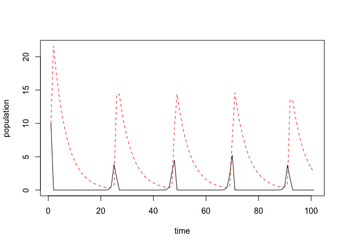
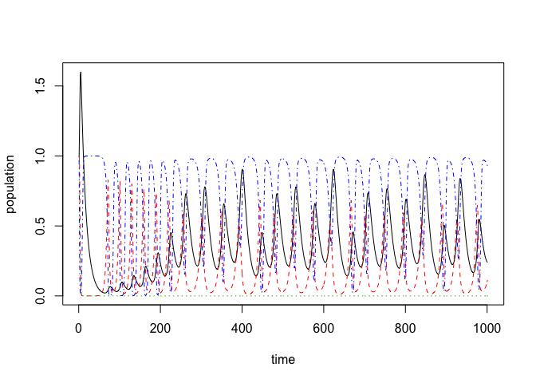

Consumer-Resource Models with Variation
================

One of the problems with the ATN model is that its goal is to generate "realistic" (or allometrically-constrained) networks of species that stably coexist. In modern coexistence theory, interested in how variation can influence coexistence.

Example ODE in R
----------------

Load functions we'll use throughout

``` r
library(tidyverse); library(deSolve)
```

Example code for LV model in R:

``` r
LotVmod <- function (Time, State, Pars) {
    with(as.list(c(State, Pars)), {
        dx = x*(alpha - beta*y)
        dy = -y*(gamma - delta*x)
        return(list(c(dx, dy)))
    })
}
 
Pars <- c(alpha = 2, beta = .5, gamma = .2, delta = .6)
State <- c(x = 10, y = 10)
Time <- seq(0, 100, by = 1)
 
out <- as.data.frame(ode(func = LotVmod, y = State, parms = Pars, times = Time))
 
matplot(out[,-1], type = "l", xlab = "time", ylab = "population")
```



Vasseur & Fox 2007 Ecology Letters
----------------------------------

Continuous time ODE of a 4 species system (resource, 2 consumers, 1 top predator), building on discrete time version in Ripa & Ives (2003, Theoretical Population Biology). Includes environmental fluctuation - though focus is more on the generation of population synchrony.

Note that as written, without any environmental variation in consumer mortality, the dynamics follow those of McCann, Hastings, Huxel (1998, Nature)

``` r
VassFox <- function (Time, State, Pars) {
    with(as.list(c(State, Pars)), {
      #M_C1_j = M_C1_0 * exp()
      #M_C2_j = M_C2_0 * exp()
      
      dP = - (M_P * P) + ( ( (J_P * P) * ( (O_P_C1 * C1) + ( (1 - O_P_C1) * C2) ) ) / ( (O_P_C1 * C1) + ((1 - O_P_C1) * C2) + C_0) ) 
      dC1 = - (M_C1_0 * C1) + ( (O_C1_R * J_C1 * C1 * R) / (R + R_0_1) ) - ( (O_P_C1 * J_P * P * C1) / ( (O_P_C1 * C1) + ((1 - O_P_C1) * C2) + C_0) )
      dC2 = - (M_C2_0 * C2) + ( (O_C2_R * J_C2 * C2 * R) / (R + R_0_2) ) - ( (O_P_C1 * J_P * P * C2) / ( (O_P_C1 * C1) + ((1 - O_P_C1) * C2) + C_0) )
      dR = r * R * (1 - (R / K)) - ( (O_C1_R * J_C1 * C1 * R) / (R + R_0_1) ) - ( (O_C2_R * J_C2 * C2 * R) / (R + R_0_2) )
      
      return(list(c(dP, dC1, dC2, dR)))
      
    })
}


# from Table 1
pars <- c(
  # resource intrinsic rate of growth
  r = 1.0,
  # resource carrying capacity
  K = 1.0,
  # consumer 1 ingestion rate
  J_C1 = 0.8036,
  # consumer 2 ingestion rate
  J_C2 = 0.7,
  # predator ingestion rate
  J_P = 0.4,
  # medial consumer 1 mortality rate
  M_C1_0 = 0.4,
  # medial consumer 2 mortality rate
  M_C2_0 = 0.2,
  # predator mortality rate
  M_P = 0.08,
  # half saturation constant
  R_0_1 = 0.16129,
  R_0_2 = 0.9,
  C_0 = 0.5,
  # preference coefficient
  O_P_C1 = 0.92,
  O_C1_R = 1.0,
  O_C2_R = 0.98
)

State <- c(P = 1, C1 = 1, C2 = 1, R = 1)
Time <- seq(0, 1000, by = 1)
 
VF_out <- as.data.frame(ode(func = VassFox, y = State, parms = pars, times = Time))
matplot(VF_out[,-1], type = "l", xlab = "time", ylab = "population")
```



Will need to figure out how to implement the covariance (equations 1 & 2 in Vasseur & Fox, also equations 3 & 4 in Gouhier et al. 2010 Am Nat)
