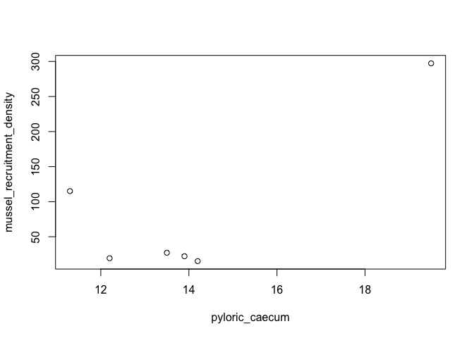
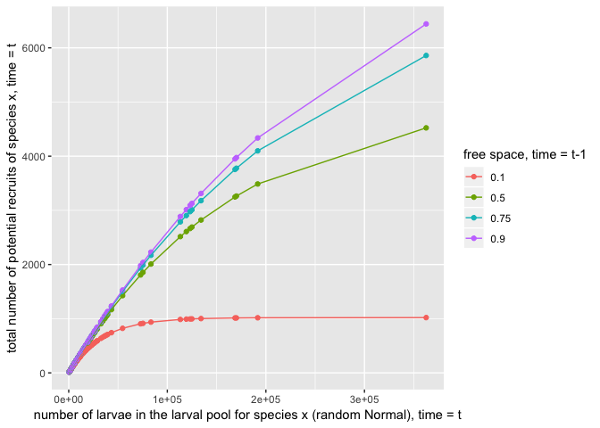
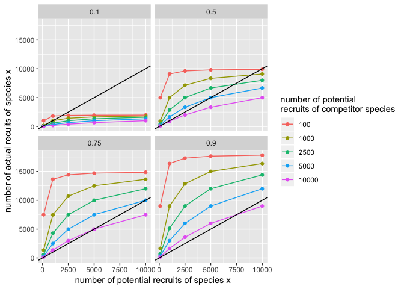

Testing assumptions in the Forde & Doak model
================

Quick plots and tests of various concepts that are embedded in the forde & doak model.

``` r
library(tidyverse)
```

fecundity & recruitment assumption
----------------------------------

is local fecundity related to mussel recruitment density? forde & doak say no. test using data from sanford & menge 2007 meps.

``` r
mussel_recruitment_density <- c(15.2, 27.2, 22.2, 19.4, 297.3, 115.1)
pyloric_caecum <- c(14.2, 13.5, 13.9, 12.2, 19.5, 11.3)
cor.test(mussel_recruitment_density, pyloric_caecum)
```

    ## 
    ##  Pearson's product-moment correlation
    ## 
    ## data:  mussel_recruitment_density and pyloric_caecum
    ## t = 2.3901, df = 4, p-value = 0.07516
    ## alternative hypothesis: true correlation is not equal to 0
    ## 95 percent confidence interval:
    ##  -0.1182426  0.9729273
    ## sample estimates:
    ##       cor 
    ## 0.7669125



no statistical relationship, just like f&d assumes

potential recruitment assumptions
---------------------------------

from forde & doak 2004 meps

potential recruitment function: should have saturating number of recruits as the number of larvae in the pool increases and free space decreases

``` r
B.mean <- 50000
B.stdev <- sqrt(3.24*10^10)
location.B <- log(B.mean^2 / sqrt(B.stdev^2 + B.mean^2))
shape.B <- sqrt(log(1 + (B.stdev^2 / B.mean^2)))

a_x <- 3 * (10^-6) # barnacle recruit size from f&d
l_x <- rlnorm(n=100, location.B, shape.B)
F_tprev <- c(0.1, 0.5, 0.75, 0.9)
A_x <-  9.8 * (10^-5) # adult barn size

do_L_x <- function(a_x, l_x, F_tprev) (F_tprev / A_x) * (1 - exp(-(a_x * l_x )/ F_tprev))
```



behaves the way we think it should

actual recruitment assumptions
------------------------------

should never get more actual recruits than potential recruits..

``` r
# given potential recruitment numbers for two species
L_x <- c(100, 1000, 2500, 5000, 10000)
L_y <- c(100, 1000, 2500, 5000, 10000)
# similar adult sizes
A_x <- 5 * (10^-5)
A_y <- A_x
# and a range of free space
F_tprev <- c(0.1, 0.5, 0.75, 0.9)

do_R_x <- function(F_tprev, L_x, A_x, L_y, A_y) (F_tprev / ((L_x * A_x) + (L_y * A_y))) * L_x
```



often see that the number of actual recruits &gt;&gt; potential recruits in the larval pool, as a function of multiple factors.
